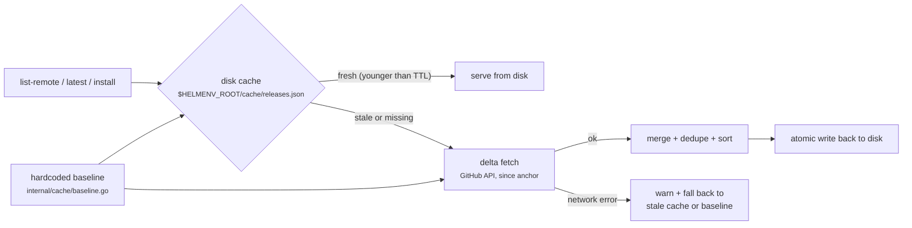

# Caching Strategy in `helm-env`

`helm-env` uses a sophisticated three-layer caching strategy to manage the list of available `helm` versions. This ensure that commands like `list-remote` and `latest` remain fast, reliable, and respectful of GitHub API rate limits.



## 1. The Three Layers

!!! info "Layer 1 — Hardcoded Baseline"
    A list of historically known stable and pre-release versions is baked directly into the `helm-env` binary (see `internal/cache/baseline.go`).

*   **Zero Latency**: Provides a useful starting point even on the very first run.
*   **Offline Fallback**: Acts as the ultimate fallback if both the disk cache and the network are unavailable.
*   **Anchor Point**: The newest version in this list is used as the "anchor" for the first delta fetch.

!!! info "Layer 2 — Disk Cache"
    When `HELMENV_ROOT` is set, `helm-env` persists the merged list of versions to a JSON file at `$HELMENV_ROOT/cache/releases.json`.

*   **Freshness**: If the cache file is younger than the TTL (Time To Live), it is served immediately without any network calls.
*   **Atomicity**: Writes use a "write-to-temp then rename" pattern to ensure that concurrent processes never read a partially written file.

!!! info "Layer 3 — Delta Fetch"
    If the disk cache is stale (older than TTL) or missing, `helm-env` performs a "delta fetch" from the GitHub API.

*   **Efficiency**: Instead of fetching all history, it only requests releases newer than the most recent version found in the stale cache (or the baseline).
*   **Auto-Merge**: New releases are automatically merged with the existing known versions, deduplicated, and sorted.
*   **Graceful Degradation**: If the network is unavailable during a delta fetch, `helm-env` will print a warning and fall back to the stale cache or the hardcoded baseline.

---

## 2. Configuration

You can customize the caching behavior using environment variables:

| Variable | Description | Default |
|----------|-------------|---------|
| `HELMENV_ROOT` | Root directory for `helm-env`. If not set, caching is memory-only (no disk persistence). | N/A |
| `HELMENV_CACHE_TTL` | How long a cache entry is considered fresh. Supports Go duration strings (e.g., `1h`, `30m`, `24h`, `0s`). | `1h` |

### Disabling the Cache
To force a fresh fetch every time, you can set the TTL to zero:
```bash
export HELMENV_CACHE_TTL=0s
```

---

## 3. Storage Format

The cache file (`releases.json`) stores:
*   `fetched_at`: UTC timestamp of the last successful fetch.
*   `versions`: List of stable versions (newest-first).
*   `prerelease_versions`: List of all versions including pre-releases (newest-first).

---

## 4. Maintenance

The hardcoded baseline should be updated periodically (e.g., when releasing a new version of `helm-env`) to keep the "lower bound" reasonably close to the current state of the world. However, the system is designed to correct itself automatically via delta fetches even if the baseline is significantly out of date.
