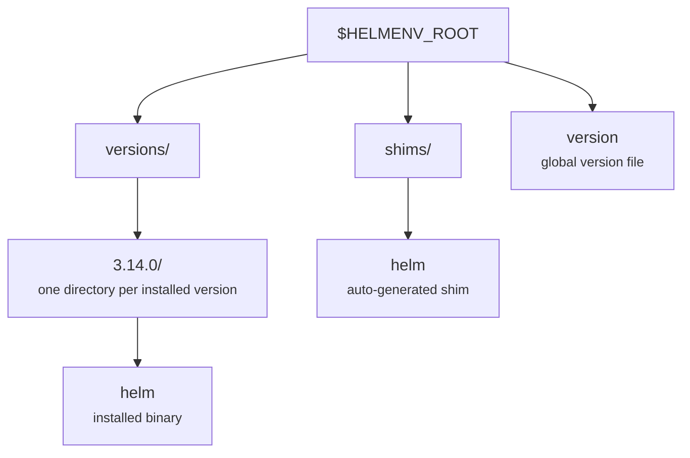

# helm-env Documentation

`helm-env` is a version manager for the [`helm`](https://helm.sh) CLI.

It installs multiple `helm` versions under a single root directory, generates a `helm` shim, and selects the correct `helm` binary at runtime based on your configured version.

!!! tip "Where to go next"
    - New here? Start with [Installation and configuration](installation-and-configuration.md).
    - Looking up a flag or command? See the [CLI reference](cli-reference.md).
    - Curious how `list-remote` / `latest` stay fast and offline-friendly? Read the [caching strategy](caching.md).

## Guides

- [Installation and configuration](installation-and-configuration.md)
- [CLI reference](cli-reference.md)
- [Caching strategy](caching.md)

## How version selection works

When you run `helm ...`, the shim selects a version using the following priority:

1. **Shell version** via `HELMENV_VERSION` (typically set by `helm-env shell` after `eval "$(helm-env init)"`).
2. **Local version** via a `.helm-version` file in the current directory or any parent directory.
3. **Global version** via `$HELMENV_ROOT/version`.

If no version is configured, the shim fails with an actionable error message.

## Project layout under `HELMENV_ROOT`

By default, `HELMENV_ROOT` is set to `~/.helmenv`.

